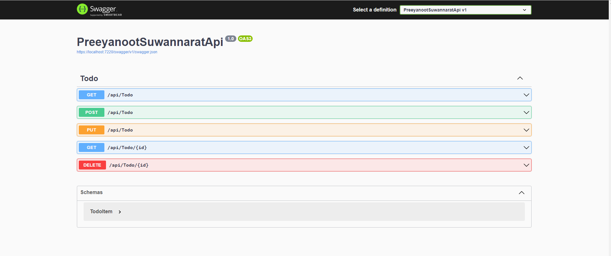

# PreeyanootSuwannaratApi
Todo CRUD with a .NET 6 Web API &amp; Entity Framework Core



### Installed Package
* Microsoft.EntityFrameworkCore
* Microsoft.EntityFrameworkCore.Design
* Microsoft.EntityFrameworkCore.SqlServer

### Note

Database Connection.
```
"DefaultConnection": "server=<servername>;database=<databasename>;trusted_connection=true"
```
Migrations.
```
dotnet ef database update
```
